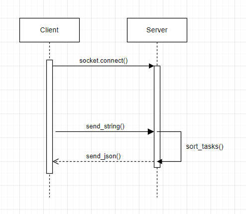

# Task-Sorter Microservice

This microservice can sort a list of tasks in a specified format.
It will sort the list by a given attribute (name, duedate, or priority).
Send a request to the server with a list of tasks and the attribut by which to sort (in the correct format), and it will return a sorted list of tasks!

## Communication Contract

### Requesting Data

#### 1. Connect to the server using ZeroMQ (REQ socket)
#### 2. Format the request as a JSON object. 
This is important since you cannot use ZeroMQ to send the objects themselves. You need to use JSON to communicate the objects to the server. The server will read the JSON and make them back into objects for sorting, before returning them in JSON again. I use a to_dict() method to accomplish the converstion from task object to the specified format. The JSON request must be in theis format:

{
    "sort": "name",  
    "tasks": [
        {
            "name": "Task Name",
            "description": "Task Description",
            "duedate": "MM/DD/YYYY",
            "priority": "Priority as a number"
        },
        ...
    ]
}

Notes: The ... represents where more tasks would go. For the "sort" key, you can replace "name" with "duedate" or "priority" as appropriate.

#### 3. Send the JSON request as a string to the server.

The json is sent using the send_string method.

#### Example (example.py):

import zmq
import json

context = zmq.Context()
socket = context.socket(zmq.REQ)
socket.connect("tcp://localhost:554")

request_data = {
    "sort": "name",
    "tasks": [
        {"name": "Homework", "description": "Math and Science", "duedate": "12/01/2024", "priority": "2"},
        {"name": "Groceries", "description": "Buy fruits and vegetables", "duedate": "11/15/2024", "priority": "5"}
    ]
}

socket.send_string(json.dumps(request_data))

### Receiving Data

#### 1. Receive the JSON Response

After sending a valid request, the server will reply. You should have code to receive this response on the client side. The response will again be in the format:

{
    "sort": "name",
    "tasks": [
        {
            "name": "Task Name",
            "description": "Task Description",
            "duedate": "MM/DD/YYYY",
            "priority": "Priority as a number"
        },
        ...
    ]
}

Notes: The ... represents where more tasks would be. For the "sort" key, the value will be the same as what was sent in the request. Please be aware that ZeroMQ can have trouble when multiple requests are sent concurrently.

#### Example (example.py):

response = json.loads(socket.recv_string())

## UML Diagram:

